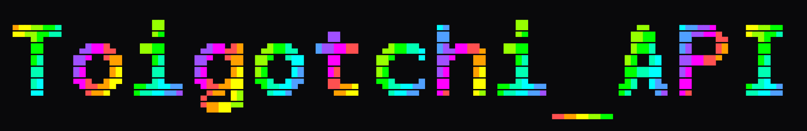

# AI-Powered Virtual Pet Simulation

> Laravel-based RESTful API simulating a virtual pet with AI-driven conversations, stat decay mechanics, and real-time state management.

## Overview

Toigotchi is a virtual pet API that combines traditional Tamagotchi mechanics with modern AI integration. Pets live, age, and respond dynamically based on their state (hunger, energy, cleanliness, health, mood).

**Key Features:**
- Real-time stat decay with scheduler-based simulation
- AI-powered conversations using Ollama (local LLM)
- Species-specific modifiers affecting gameplay
- Persistent conversation memory for contextual AI responses
- Domain-driven architecture with clean service separation

---

## Architecture

### Design Philosophy

```
Auth = Identity
Pets = Domain
AI = Behavior
```

This separation allows independent evolution of each layer without breaking others.

### Domain Structure

```
app/
├── Domain/
│   └── Pet/
│       ├── Services/                       # Business logic
│       │   ├── PetDecayService.php
│       │   ├── PetMoodService.php
│       │   ├── PetStateService.php
│       │   ├── PetStatBoundaryService.php
│       │   └── SpeciesModifierService.php
│       ├── Events/                         # Domain events
│       │   ├── PetDied.php
│       │   └── PetStatChanged.php
│       └── ValueObjects/                   # Immutable value objects
│           └── PetStats.php
├── Actions/Pets/                           # Action pattern implementation
│   ├── FeedPetAction.php
│   ├── PlayWithPetAction.php
│   ├── SleepPetAction.php
│   └── ...
├── Enums/                                  # State enums
│   ├── HungerState.php
│   ├── EnergyState.php
│   └── ...
├── Http/
│   ├── Controllers/Api/V1/                 # Thin API controllers
│   └── Requests/                           # Form request validation
├── Models/                                 # Eloquent models
└── Services/                               # External services
    └── OllamaService.php
```

### Design Patterns

| Pattern | Implementation |
|---------|----------------|
| **Action Domain** | Each pet action (feed, play) is a separate class implementing `PetActionContract` |
| **Dispatcher** | `PetActionManager` uses `match` expression for action routing |
| **Service Layer** | Domain logic isolated in `PetDecayService`, `PetMoodService`, etc. |
| **Value Object** | `PetStats` encapsulates stat clamping and validation |
| **Event Sourcing** | `PetDied`, `PetStatChanged` events for decoupled workflows |
| **State Enum** | Semantic states (`HungryState`, `EnergyState`) for AI context |

---

## API Endpoints

Base URL: `/api/v1`

### Authentication

| Method | Endpoint | Description |
|--------|----------|-------------|
| POST | `/api/login` | User login |
| POST | `/api/register` | User registration |
| POST | `/api/logout` | Logout current session |
| GET | `/api/me` | Get authenticated user |

**Login Request:**
```json
{
  "email": "user@example.com",
  "password": "password123"
}
```

**Response:**
```json
{
  "access_token": "base64_encoded_token",
  "token_type": "Bearer"
}
```

---

### Pets CRUD

| Method | Endpoint | Description |
|--------|----------|-------------|
| GET | `/api/v1/pets` | List user's pets |
| POST | `/api/v1/pets` | Create new pet |
| GET | `/api/v1/pets/{id}` | Get pet details |
| PATCH | `/api/v1/pets/{id}` | Update pet |
| DELETE | `/api/v1/pets/{id}` | Delete pet |

**Create Pet Request:**
```json
{
  "name": "Mochi",
  "species": "blobcat"
}
```

**Species Available:** `blobcat`, `foxkid`, `draggle`

**Pet Response:**
```json
{
  "data": {
    "id": 1,
    "name": "Mochi",
    "species": "blobcat",
    "health": 100,
    "energy": 85,
    "hunger": 15,
    "cleanliness": 90,
    "mood": "happy",
    "is_alive": true,
    "created_at": "2026-04-29T18:00:00Z"
  }
}
```

---

### Pet Actions

| Method | Endpoint | Description |
|--------|----------|-------------|
| POST | `/api/v1/pets/{id}/actions` | Execute action |
| GET | `/api/v1/pets/{id}/actions` | Get action history |

**Execute Action Request:**
```json
{
  "type": "feed",
  "payload": {
    "food": "apple"
  }
}
```

**Action Types:**

| Type | Effect | Payload Required |
|------|--------|------------------|
| `feed` | hunger -20, mood +5 | `{"food": "string"}` |
| `play` | energy -15, mood +10 | - |
| `sleep` | energy +30, hunger +10 | - |
| `clean` | cleanliness +25, mood +5 | - |
| `heal` | health +20 | - |
| `talk` | mood +5 | `{"message": "string"}` |

---

### AI Chat

| Method | Endpoint | Description |
|--------|----------|-------------|
| POST | `/api/v1/pets/{id}/chat` | Chat with AI |
| GET | `/api/v1/pets/{id}/memories` | Get conversation history |

**Chat Request:**
```json
{
  "message": "How are you feeling today?"
}
```

**Chat Response:**
```json
{
  "reply": "I'm feeling happy! Thanks for asking.",
  "pet": {
    "id": 1,
    "name": "Mochi",
    "mood": "happy"
  }
}
```

---

## Species Modifiers

Each species has unique decay rates and efficiency modifiers:

| Species | Hunger Decay | Cleanliness Decay | Food Efficiency | Happiness Boost |
|---------|-------------|-------------------|-----------------|-----------------|
| `blobcat` | +5/min | -2/min | 1.0x | 1.0x |
| `foxkid` | +4/min | -3/min | 1.1x | 1.5x |
| `draggle` | +3/min | -1/min | 0.8x | 0.8x |

---

## State System

### State Enums for AI Context

Stats are converted to semantic states for better AI prompt generation:

**HungerState:**
- `full` (0-10)
- `satisfied` (11-40)
- `hungry` (41-70)
- `starving` (71-100)

**EnergyState:**
- `exhausted` (0-20)
- `tired` (21-40)
- `normal` (41-70)
- `energetic` (71-100)

**CleanlinessState:**
- `dirty` (0-30)
- `normal` (31-70)
- `clean` (71-100)

**HealthState:**
- `critical` (0-20)
- `sick` (21-50)
- `normal` (51-80)
- `healthy` (81-100)

---

## Stat Decay System

The simulation runs via Laravel Scheduler:

```bash
php artisan pets:decay
```

**Default Decay Rates (per minute):**
- Hunger: +5
- Energy: -3
- Cleanliness: -2
- Health: -1 (only when hunger >= 80)

**Death Conditions:**
- Hunger reaches 100
- Health reaches 0

---

## Installation

### Requirements

- PHP 8.4+
- SQLite (bundled with PHP)
- Ollama (for AI chat)

### Setup

```bash
# Install dependencies
composer install

# Generate app key
php artisan key:generate

# Run migrations
php artisan migrate

# Seed database
php artisan db:seed

# Start scheduler (for stat decay)
php artisan schedule:work

# Start server
php artisan serve
```

### Ollama Setup

```bash
# Pull model
ollama pull llama3.2:1b

# Start Ollama server (or via DBMain)
ollama serve
```

### Environment Variables

```env
OLLAMA_URL=http://localhost:11434
OLLAMA_MODEL=llama3.2:1b
```

---

## Testing

```bash
# Run all tests
php artisan test

# Tests: 61 passing
```

### Test Coverage

| Suite | Tests |
|-------|-------|
| PetApiTest (CRUD) | 8 |
| PetActionTest | 7 |
| PetChatTest | 6 |
| PetDecayServiceTest | 8 |
| PetMoodServiceTest | 7 |
| PetStatBoundaryServiceTest | 5 |
| PetStateServiceTest | 10 |
| SpeciesModifierServiceTest | 8 |

---

## Database Schema

```
users
├── pets
│   ├── pet_actions (action history)
│   └── pet_memories (AI conversation history)
└── oauth_* (Passport tables)
```

---

## Future Phases

- [ ] **Phase 5**: Memory + Personality System
  - Persistent AI memories with importance scoring
  - Dynamic personality traits based on interaction history
  - Achievement system integration

- [ ] **Phase 6**: Multiplayer/Social Features
  - Pet trading
  - Shared gardens
  - Pet battles

- [ ] **Phase 7**: Real-time Updates
  - WebSocket integration for live stat updates
  - Push notifications for pet needs

---

## Tech Stack

- **Framework**: Laravel 13
- **Database**: SQLite (dev) / MySQL, PostgreSQL (prod)
- **AI**: Ollama (local LLM)
- **Auth**: Laravel Passport (OAuth)
- **Testing**: PHPUnit

---

## License

MIT License.